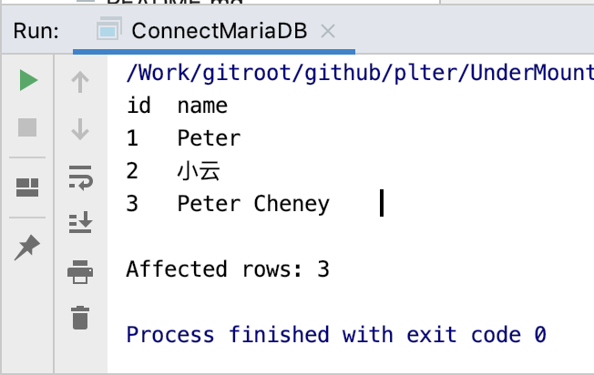

# Example code 

```cpp
#include <um.h>
#include <boost/asio/use_awaitable.hpp>
#include <MariaDBConnection.h>
#include <memory>

int main() {

    auto conn = std::make_shared<um::MariaDBConnection>();
    conn->connect("127.0.0.1", "mydb", "root", "example", "utf8", 3306);

    um::DbGridSPtr result;
    auto count = conn->executeSQL("SELECT * FROM user WHERE id > 0", result);
    std::cout << result->toString() << std::endl;
    std::cout << "Affected rows: " << count << std::endl;
    conn->close();
    return 0;
}
```

# Result 

